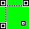
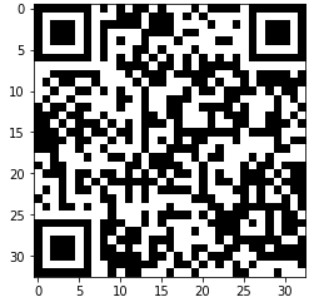

# Reading the Stars
## Category: ML | Difficulty: Hard

> You've obtained an ancient star chart, used for navigation eons ago. It could provide useful on your mission, but first you need to learn how to decipher it.

ml_reading_the_stars.zip

I couldn't upload the zip itself because it was too big.

---

(This one took multiple days of effort.)

Unzip the files first.

```
challenge.ipynb
mask.png
model.py
test.h5
train.1.h5
train.2.h5
```

Let's take a look at `mask.png`.



Looks like a 33x33 QR code. I guess this is what our end goal is.

For the other files, we have some training data and test data. So we're going to have to train a model and get a flag by putting the test data through it. Finally some actual machine learning!

It looks like they provided us with a `model.py`, so we won't have to figure out the architecture of the model. Looking at `StarChartModel(dropout=[0.0,0.0], out_classes=2)`, we might have to adjust the drop out layer.

We'll work in [challenge.ipynb](challenge.ipynb) first as we did before. Look in there for the rest of the writeup.

---

This is the final QR code I got:


