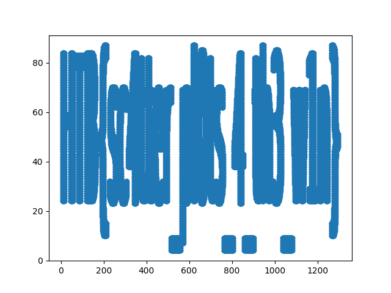

# Reconfiguration 
## Category: ML | Difficulty: Very easy

> As Pandora set out on her quest to find the ancient alien relic, she knew that the journey would be treacherous. The desert was vast and unforgiving, and the harsh conditions would put her cyborg body to the test. Pandora started by collecting data about the temperature and humidity levels in the desert. She used a scatter plot in an Orange Workspace file to visualize this data and identified the areas where the temperature was highest and the humidity was lowest. Using this information, she reconfigured her sensors to better withstand the extreme heat and conserve water. But, a second look at the data revealed something otherwordly, it seems that the relic's presence beneath the surface has scarred the land in a very peculiar way, can you see it?

[ml_reconfiguration.zip](ml_reconfiguration.zip)

---

Let's see what's inside the zip file.
```
analysis.ows
points.csv
```

Never really used Orange Workspace, so we'll ignore that for now. The challenge description mentions scatter plots, so we'll start out by plotting [points.csv](points.csv) and see where that takes us.

Let's add a header row to [points.csv](points.csv) just to make it the slightest bit easier to import as a [pandas dataframe](https://pandas.pydata.org/docs/reference/api/pandas.DataFrame.html).

```
[points.csv]
x,y
2.030000000000000000e+02,8.700000000000000000e+01
...
```

Alright, now let's use [matplotlib.pyplot.scatter](https://matplotlib.org/3.5.1/api/_as_gen/matplotlib.pyplot.scatter.html) and plot the points.

```python
import matplotlib.pyplot as plt
import pandas as pd

df = pd.read_csv('points.csv')

plt.scatter(df['x'], df['y'])
plt.show()
```



That kind of looks like text. Let's make the plot wider so we can read it.

```python
plt.figure(figsize=(20, 2))
plt.scatter(df['x'], df['y'])
plt.show()
```


Looks like we found the flag! `HTB{sc4tter_pl0ts_4_th3_w1n}`
